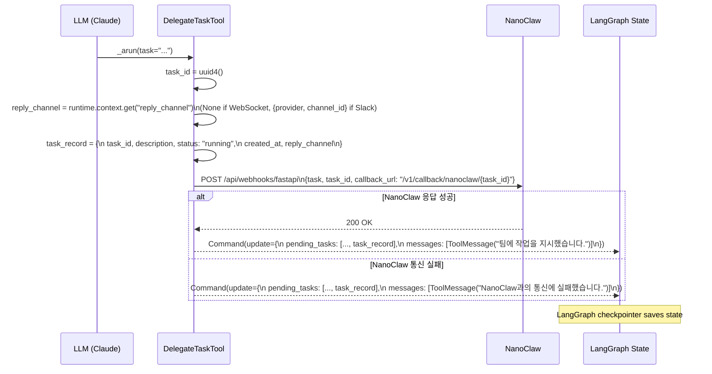
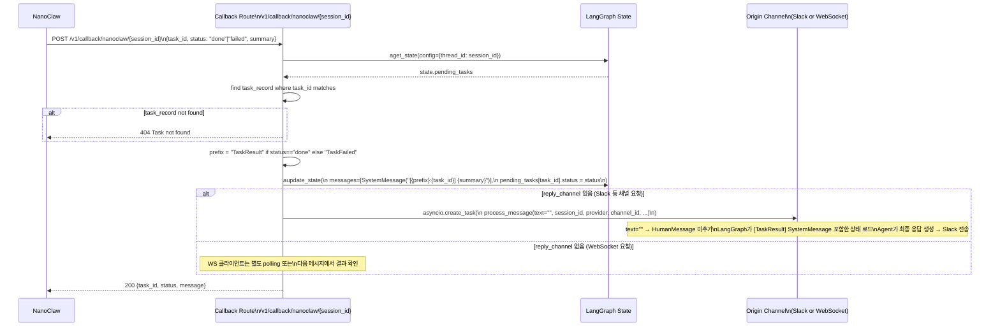

# DelegateTask Flow

Updated: 2026-04-05

## Overview

`DelegateTaskTool`은 AgentService가 무거운 작업을 NanoClaw에 위임할 때 사용한다.
WebSocket 채팅과 Slack 채널 양쪽에서 동일한 흐름으로 동작한다.

위임 흐름:
1. Agent → `DelegateTaskTool` 호출 → NanoClaw에 작업 전송
2. NanoClaw가 비동기로 작업 수행
3. NanoClaw → Backend callback → LangGraph state에 결과 주입 → 원 채널에 최종 응답

`reply_channel`은 STM metadata가 아닌 LangGraph state의 `pending_tasks[task_id]["reply_channel"]`에 저장된다.

---

## Phase 1: Task Delegation



---

## Phase 2: NanoClaw Callback



---

## reply_channel 유무에 따른 차이

| 채널 | reply_channel | Callback 후 동작 |
|------|--------------|-----------------|
| Slack | `{provider: "slack", channel_id: "C..."}` | `process_message(text="")` → Slack 자동 전송 |
| WebSocket | `None` | state 갱신만. 클라이언트가 다음 메시지에서 결과 수신 |

---

## LangGraph State 스키마 (관련 필드)

```python
# CustomAgentState (state.py)
pending_tasks: list[PendingTask]

# PendingTask (TypedDict)
{
    "task_id": str,
    "description": str,
    "status": "running" | "done" | "failed",
    "created_at": str,  # ISO 8601 UTC
    "reply_channel": {"provider": str, "channel_id": str} | None,
}
```

---

## Appendix

- 구현: `backend/src/services/agent_service/tools/delegate/delegate_task.py`
- Callback 라우트: `backend/src/api/routes/callback.py`
- State 스키마: `backend/src/services/agent_service/state.py`
- NanoClaw webhook: `POST /api/webhooks/fastapi` (NanoClaw HTTP Channel)
- timeout: 5s (httpx AsyncClient — 초과 시 실패 메시지, 태스크는 계속 pending_tasks에 유지됨)
