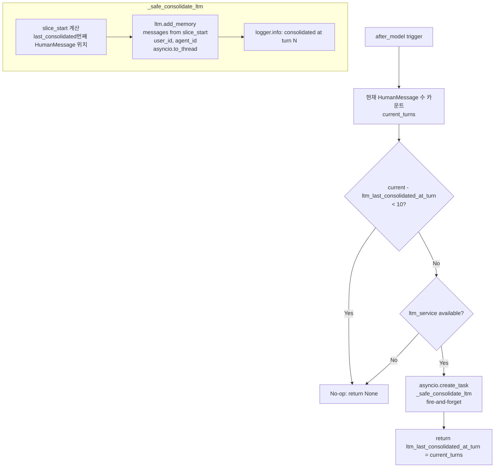
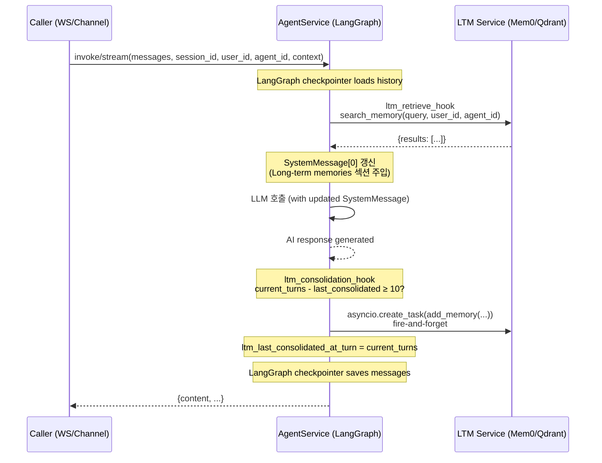

# LTM Middleware Flow

Updated: 2026-04-05

## Overview

LTM(Long-Term Memory) 미들웨어는 모든 AgentService 호출(WebSocket + Channel 공통)에 자동으로 적용된다.
`openai_chat_agent.py`에서 두 훅이 wired in된다:

- `before_model(ltm_retrieve_hook)` — 모델 호출 직전, LTM 검색 결과를 SystemMessage에 주입
- `after_model(ltm_consolidation_hook)` — 모델 호출 직후, 10턴마다 fire-and-forget 통합

두 훅 모두 직접 호출하지 않는다 — LangGraph 미들웨어 레이어가 자동 실행한다.

---

## Hook 1: ltm_retrieve_hook (before_model)

```mermaid
flowchart TD
    A[before_model trigger] --> B{ltm_service available?}
    B -- No --> Z[No-op: return None]
    B -- Yes --> C{user_id in state?}
    C -- No --> Z
    C -- Yes --> D[Extract text from latest HumanMessage]
    D --> E{query 비어있음?}
    E -- Yes --> Z
    E -- No --> F[ltm.search_memory\nasyncio.to_thread\nquery, user_id, agent_id]
    F --> G{results 있음?}
    G -- No --> Z
    G -- Yes --> H{messages[0]이 SystemMessage\n with id?}
    H -- No --> Z2[No-op: skip injection\nOpenAI는 non-system 이후 SystemMessage 거부]
    H -- Yes --> I[SystemMessage 갱신\nid 유지하여 add_messages가 replace\ncontent = base_content + LTM section]
    I --> J[return updated messages state]
```

**주의사항:**
- LTM 주입은 항상 `messages[0]` SystemMessage를 in-place 갱신 (id 보존)
- SystemMessage가 없거나 id가 없으면 주입 건너뜀 (OpenAI API 제약)
- 이전 LTM 주입이 있으면 `\n\nLong-term memories:` 이후를 교체 (중복 방지)
- 실패 시 error 로깅 후 `None` 반환 — 에이전트 실행은 계속됨

---

## Hook 2: ltm_consolidation_hook (after_model)



**주의사항:**
- 통합은 `asyncio.create_task`로 fire-and-forget — 에이전트 응답을 블록하지 않음
- 슬라이싱: `last_consolidated`번째 HumanMessage부터 이후 메시지만 통합 (중복 방지)
- 실패 시 `_safe_consolidate_ltm`이 에러 로깅 후 조용히 종료
- `ltm_last_consolidated_at_turn` 갱신은 동기적으로 state에 반영됨

---

## 전체 Agent 호출 내 위치



---

## Appendix

- 구현: `backend/src/services/agent_service/middleware/ltm_middleware.py`
- wired in: `backend/src/services/agent_service/service.py` (`create_agent(middleware=[...])`)
- consolidation 간격: `_LTM_CONSOLIDATION_INTERVAL = 10` (HumanMessage 턴 수)
