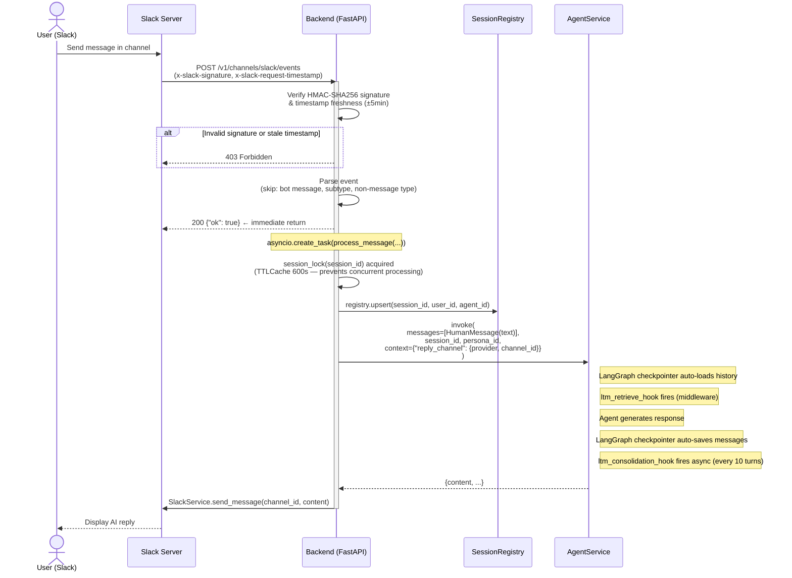
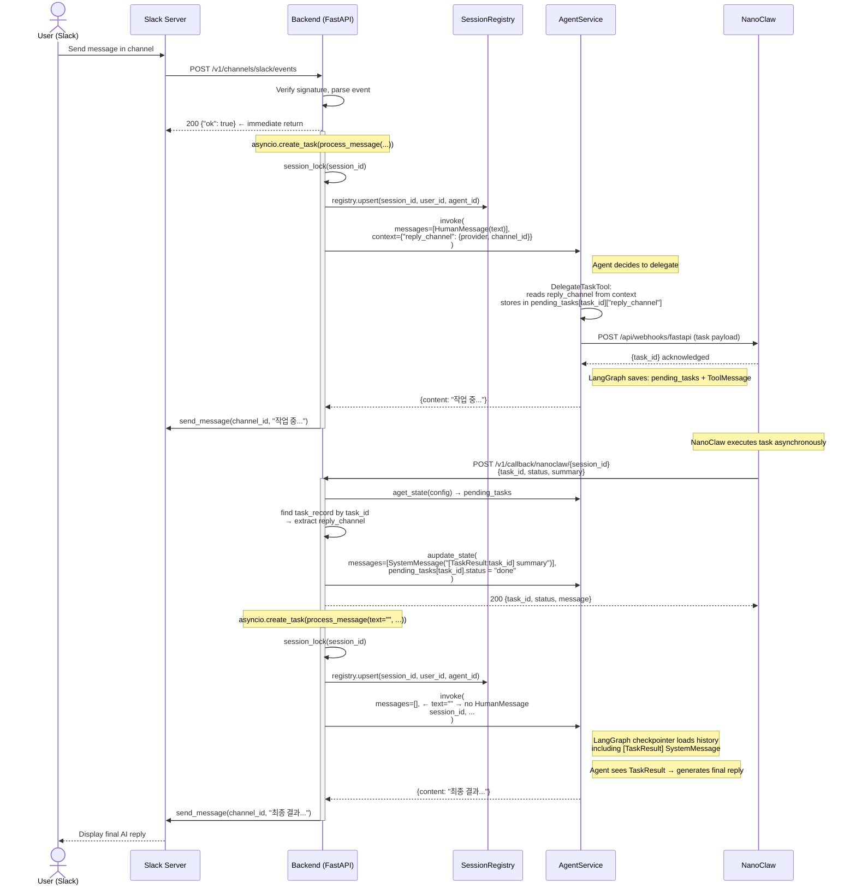
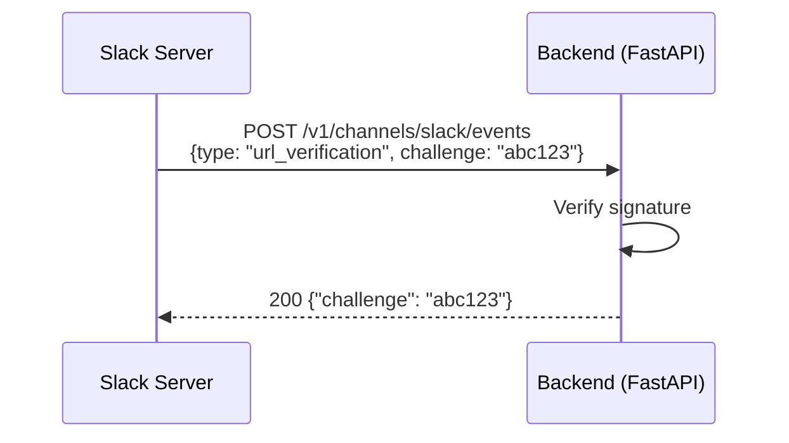

# SLACK_MESSAGE Data Flow

Updated: 2026-04-05

## Overview

Slack 채널 메시지 처리에는 두 가지 경로가 있다.

1. **Direct Flow** — 에이전트가 즉시 응답 (delegation 없음)
2. **Delegation Flow** — 에이전트가 NanoClaw에 작업을 위임하고, 완료 후 콜백으로 응답

세션 ID 형식: `slack:{team_id}:{channel_id}:{user_id}` (현재 `user_id`는 상수 `"default"`)

> **Architecture Note**  
> STM 영속성은 LangGraph `MongoDBSaver` checkpointer가 자동 처리한다 — channel_service에 별도 save/load 호출 없음.  
> LTM retrieval/consolidation은 AgentService 내부 middleware가 처리한다 (`ltm_retrieve_hook`, `ltm_consolidation_hook`).  
> `reply_channel`은 STM metadata가 아닌 LangGraph state의 `pending_tasks[task_id]["reply_channel"]`에 저장된다.

---

## Flow 1: Direct Message (No Delegation)

---

## Flow 2: Delegation Flow (NanoClaw Task)

에이전트가 `DelegateTaskTool`을 사용해 NanoClaw에 작업을 위임하는 경우.

---

## Flow 3: URL Verification (App Setup, One-Time)

---

## Key Implementation Details

### Signature Verification

- Algorithm: HMAC-SHA256 over `v0:{timestamp}:{body}`
- Timestamp tolerance: ±5 minutes (replay attack prevention)
- Comparison: `hmac.compare_digest` (timing-safe)

### Session Lock

- `session_lock(session_id)`: `cachetools.TTLCache` 기반 async context manager
- TTL: 600s, maxsize: 1024
- 동일 세션의 동시 처리 방지 (빠른 연속 메시지, callback 재진입)

### reply_channel 저장 위치

- `process_message(context={"reply_channel": ...})` → `agent_service.invoke(context=...)` 전달
- `DelegateTaskTool`이 context에서 읽어 LangGraph state의 `pending_tasks[task_id]["reply_channel"]`에 저장
- Callback 핸들러가 `aget_state()` → `pending_tasks`에서 `reply_channel` 읽어 라우팅 결정

### process_message `text=""` 경로 (Callback)

- `text`가 비어있으면 `HumanMessage` 미추가
- LangGraph checkpointer가 이미 `[TaskResult:task_id]` `SystemMessage`를 포함한 상태로 로드
- 에이전트가 TaskResult를 기반으로 최종 응답 생성

### Error Handling

- `process_message` 예외 시 Slack으로 에러 메시지 전송: `"처리 중 오류가 발생했어. 다시 시도해줘"`
- 에러는 백그라운드 태스크에서 발생하므로 Slack에 `{"ok": true}`가 이미 반환된 이후

---

## Appendix

### PatchNote

2026-04-05: 전면 개정 — STM Service 참조 제거(현재 LangGraph checkpointer 자동 처리), reply_channel 저장 위치 정정(STM metadata → pending_tasks LangGraph state), load_context/save_turn explicit call 제거, LTM middleware 설명 추가.
2026-03-19: 초기 작성.

- [NanoClaw Callback](../../../backend/src/api/routes/callback.py)
- [ADD_CHAT_MESSAGE Data Flow](../chat/ADD_CHAT_MESSAGE.md)
