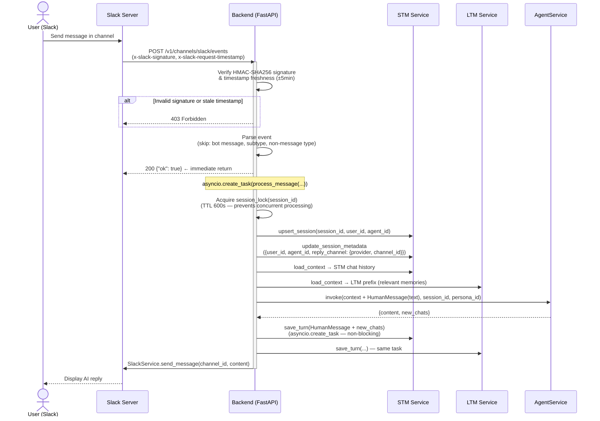
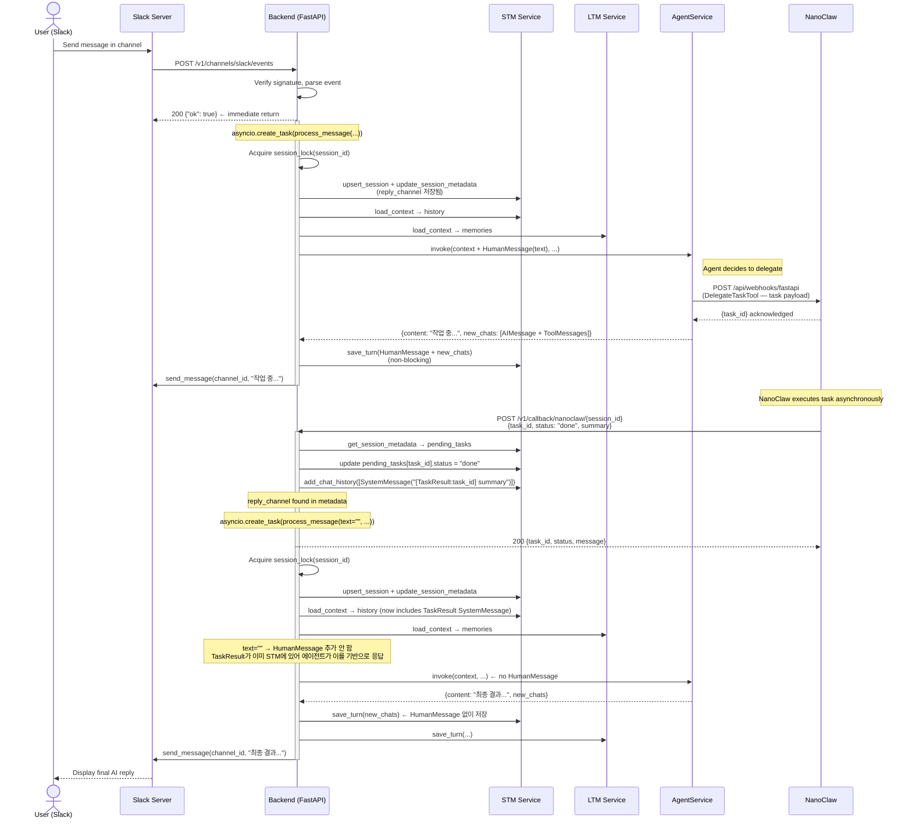
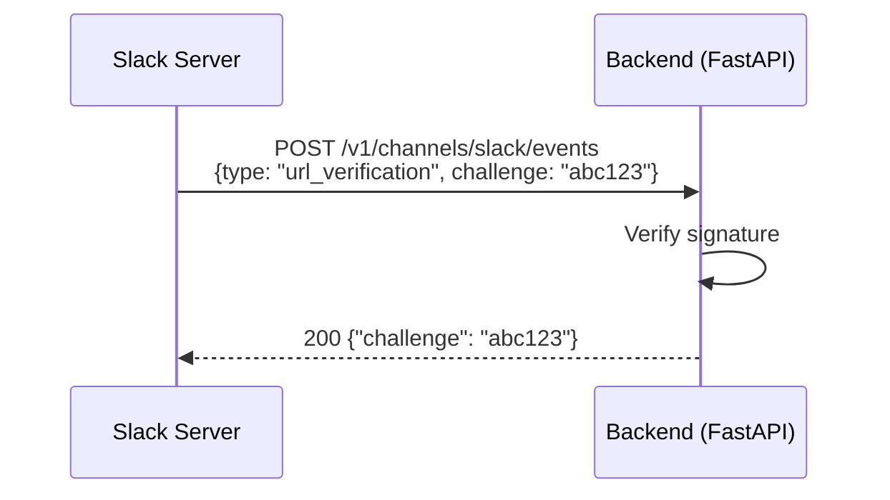

# SLACK_MESSAGE Data Flow

Updated: 2026-03-19

## Overview

Slack channel 메시지 처리에는 두 가지 경로가 있다.

1. **Direct Flow** — 에이전트가 즉시 응답 (delegation 없음)
2. **Delegation Flow** — 에이전트가 NanoClaw에 작업을 위임하고, 완료 후 콜백으로 응답

세션 ID 형식: `slack:{team_id}:{channel_id}:{user_id}` (현재 `user_id`는 상수 `"default"`)

---

## Flow 1: Direct Message (No Delegation)



---

## Flow 2: Delegation Flow (NanoClaw Task)

에이전트가 `DelegateTaskTool`을 사용해 NanoClaw에 작업을 위임하는 경우.



---

## Flow 3: URL Verification (App Setup, One-Time)



---

## Key Implementation Details

### Signature Verification

- Algorithm: HMAC-SHA256 over `v0:{timestamp}:{body}`
- Timestamp tolerance: ±5 minutes (replay attack prevention)
- Comparison: `hmac.compare_digest` (timing-safe)

### Session Lock

- `session_lock(session_id)`: `cachetools.TTLCache` 기반 async context manager
- TTL: 600s, maxsize: 1024
- 동일 세션의 동시 처리를 방지한다 (예: 빠른 연속 메시지, callback 재진입)

### reply_channel Metadata

- `process_message()` 최초 호출 시 STM session metadata에 저장됨:
  ```json
  {"provider": "slack", "channel_id": "C5678"}
  ```
- Callback 핸들러가 이 값을 확인해 Slack 라우팅 결정
- WebSocket 세션에는 `reply_channel`이 없으므로 콜백 시 외부 전송 없음

### process_message `text=""` 경로 (Callback)

- `text`가 비어있으면 `HumanMessage`를 추가하지 않음
- STM에 이미 주입된 `[TaskResult:task_id]` `SystemMessage`가 에이전트 응답을 구동
- `save_turn` 시에도 `HumanMessage` 없이 `new_chats`만 저장

### Error Handling

- `process_message` 예외 시 Slack으로 에러 메시지 전송: `"처리 중 오류가 발생했어. 다시 시도해줘"`
- 에러는 백그라운드 태스크에서 발생하므로 Slack에 `{"ok": true}`가 이미 반환된 이후

---

## Appendix

- [Slack Events API Doc](../../../docs/api/Slack_Events.md)
- [NanoClaw Callback Doc](../../../docs/api/Nanoclaw_Callback.md)
- [ADD_CHAT_MESSAGE Data Flow](../chat/ADD_CHAT_MESSAGE.md)
