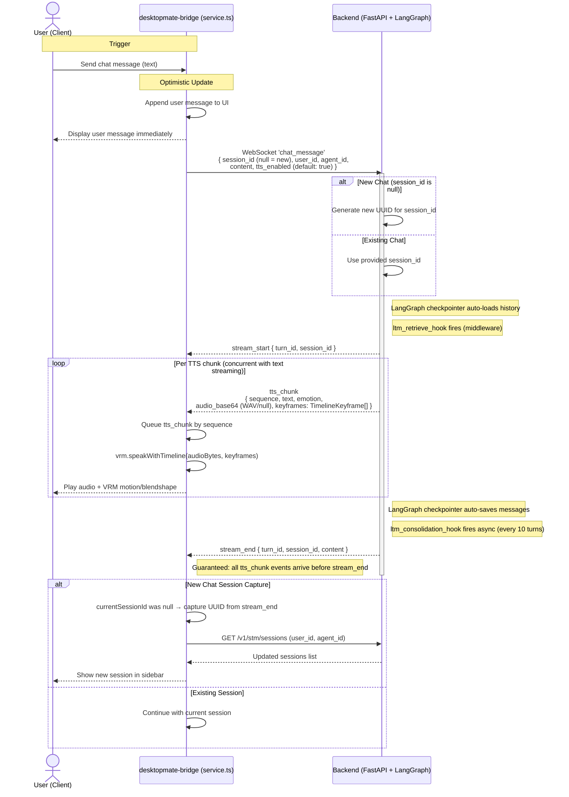

# ADD_CHAT_MESSAGE Data Flow

Updated: 2026-04-05

## Session Persistence Flow

1. **User clicks a session in the settings** → Load session history from LangGraph checkpointer via `GET /v1/stm/get-chat-history` and display in UI.

2. **User sends a message** → Sent over WebSocket as `chat_message` with current `session_id`.
   - `session_id = null` → backend creates new session (UUID generated)
   - `session_id = <uuid>` → continues existing session

3. **New chat session capture**: Backend returns the generated UUID in `stream_end`. Frontend captures it and updates `currentSessionId`.

> **Architecture Note**  
> STM 영속성은 LangGraph `MongoDBSaver` checkpointer가 자동 처리한다 — no explicit save calls.  
> LTM retrieval/consolidation은 AgentService 내부 middleware(`ltm_retrieve_hook`, `ltm_consolidation_hook`)가 처리한다.  
> TTS 오디오 포맷은 **WAV** (base64 인코딩).

---

## Data Flow Diagram



---

## Key Implementation Details

### tts_chunk Payload

```json
{
  "sequence": 0,
  "text": "안녕하세요.",
  "emotion": "happy",
  "audio_base64": "<WAV base64 string or null>",
  "keyframes": [
    { "duration": 0.3, "targets": { "happy": 1.0 } }
  ]
}
```

- `audio_base64`: WAV base64. `tts_enabled=false` 또는 TTS 실패 시 `null`
- `keyframes`: `list[TimelineKeyframe]` — `EmotionMotionMapper`가 emotion → keyframes 변환
- `motion_name` / `blendshape_name` 필드는 제거됨 (keyframes로 통합)

### TTS Enabled / Disabled

- `tts_enabled: true` (default) — BE가 WAV 합성 → `audio_base64` 설정
- `tts_enabled: false` — 합성 건너뜀 → `audio_base64=null`. VRM motion은 그대로 적용

### TTS Barrier

- Backend는 모든 `tts_chunk` 태스크 완료 후 `stream_end` 전송 (max 10s per chunk)
- FE는 `stream_end` 수신 시 해당 turn의 모든 `tts_chunk`가 이미 도착했음을 보장받음

### Session ID Capture

- **New Chat**: `session_id=null` → backend가 UUID 생성 → `stream_end`에 포함
- **Frontend Capture**: `stream_end` 핸들러에서 `currentSessionId`가 null이면 UUID 캡처
- Optimistic UI 유지 (null → UUID 전환 시 메시지 리로드 없음)

---

## Appendix

### PatchNote

2026-04-05: 전면 개정 — FE 레이블 정정(Mate-Engine → desktopmate-bridge), STM Service 참조 제거(LangGraph checkpointer 자동 처리), tts_chunk 페이로드 정정(motion_name/blendshape_name → keyframes: TimelineKeyframe[]), 오디오 포맷 정정(MP3 → WAV), LTM middleware 설명 추가.
2026-03-15: 초기 작성.

### Related

- [WebSocket API Guide](../../backend/docs/websocket/CLAUDE.md)
- [TTS Service Patterns](../../backend/src/services/tts_service/CLAUDE.md)
- [SLACK_MESSAGE Data Flow](../channel/SLACK_MESSAGE.md)
