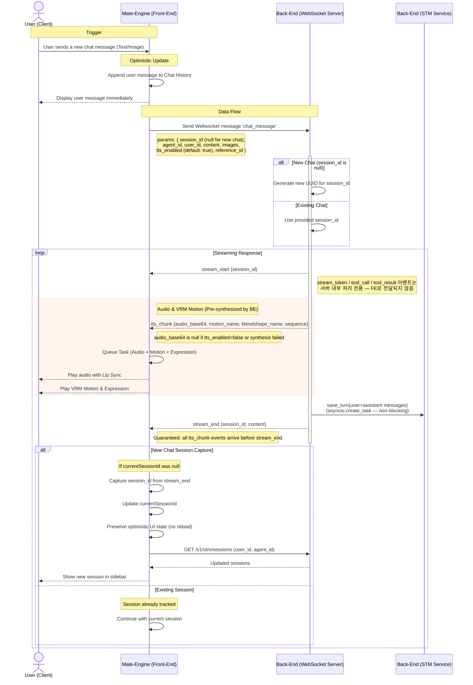

# ADD_CHAT_MESSAGE Data Flow

Updated: 2026-03-15

## Session Persistence Flow

### Correct Flow

1. **User clicks a session in the settings** → Load that session's history from STM and draw the chat_history to UI.

2. **User sends a message** → Should be stored to the currently selected session_id
   - Saving logic handled by backend. FE only handles `session_id` for that.
   - When `session_id` is null → backend perceives that as new chat.
   - When `session_id` is not null → backend perceives that as existing chat.

3. **When creating a new chat**, `session_id` starts as null, backend generates UUID, and frontend captures it from `stream_end` event.

## DATA FLOW DIAGRAM

## Detailed Point about Audio Synthesis

1. **Trigger**: Backend analyzes the stream and determines a complete sentence/phrase is ready for speech.
2. **Synthesis**: Backend synthesizes audio via TTS engine (`asyncio.to_thread`) — parallel to text streaming.
3. **Delivery**: Backend sends `tts_chunk` WebSocket message containing pre-synthesized **audio_base64** (MP3), **emotion**, **motion_name**, **blendshape_name**, and **sequence**.
4. **Queueing**: Frontend receives the chunk and enqueues it directly — no additional API call needed.
   - Queue Item: `{ audio_base64, motion_name, blendshape_name, sequence }`
5. **Playback**: Audio is played in sequence order, synchronized with Live2D lip-sync movements.
   - Audio: MP3 base64 디코딩 후 재생 + 립싱크 모듈 연동.
   - VRM: AnimationPlayer로 `motion_name` 재생 + `blendshape_name` 적용.
   - `audio_base64 = null`인 경우 오디오 재생 생략, 모션은 그대로 적용.

## Key Implementation Details

### TTS Enabled / Disabled

- `tts_enabled: true` (default) — BE synthesizes audio; `audio_base64` is a base64 MP3 string.
- `tts_enabled: false` — BE skips synthesis; `audio_base64` is `null`. Avatar still plays motion/blendshape.
- `reference_id` — optional voice ID. `null` = engine default voice.

### TTS Barrier

- Backend awaits all `tts_chunk` tasks (max 10s) before sending `stream_end`.
- FE can safely assume that when `stream_end` arrives, all `tts_chunk` events for that turn have been delivered.

### Session ID Capture Logic

- **New Chat**: When `session_id` is `null`, backend generates a UUID and returns it in the `stream_end` event.
- **Frontend Capture**: Frontend checks if `currentSessionId` is null in the `stream_end` handler. If so, it captures and stores the backend-generated UUID.
- **Optimistic UI Preservation**: The context prevents reloading messages when transitioning from `null` → UUID to avoid UI flicker.
- **Subsequent Messages**: Next message uses the captured `session_id`, ensuring all messages belong to the same session.

### STM Persistence

- Backend automatically saves both user and assistant messages to STM (Short Term Memory) when processing completes.
- Frontend does not directly call STM APIs for saving; it only reads history when loading sessions.
- Session persistence is guaranteed by the backend's `stream_end` logic.

## Appendix

- [Backend WebSocket API](../../websocket/WEBSOCKET_API_GUIDE.md)
- [TTS Chunk Event](../../websocket/WebSocket_TtsChunk.md)
