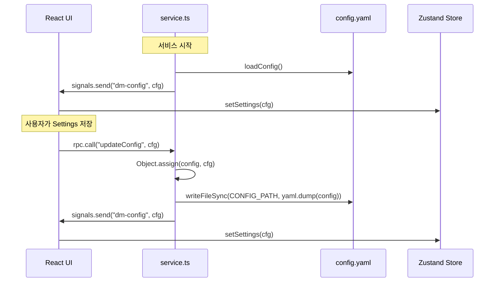

# desktopmate-bridge Config Flow

Updated: 2026-03-22

## Read (초기화)

config.yaml → loadConfig() → broadcastConfig() → dm-config 신호 → UI store.settings

## Write (updateConfig RPC)

UI Save 버튼 → rpc.call('updateConfig', cfg) → service.ts updateConfig()
  → config 객체 in-place 수정 → writeFileSync(CONFIG_PATH, yaml.dump(config))
  → broadcastConfig() → dm-config 신호 → UI store.settings 갱신

## Diagram

