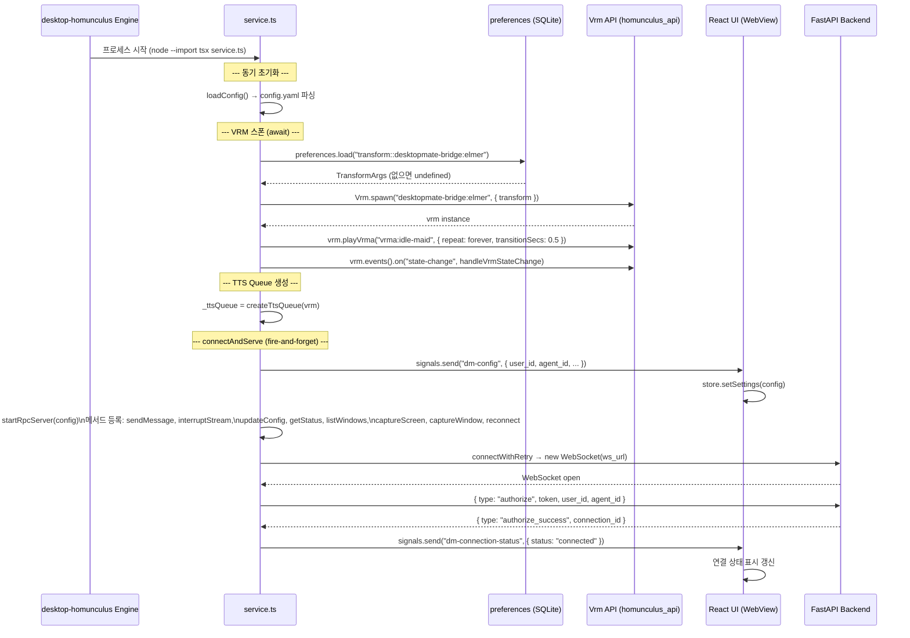
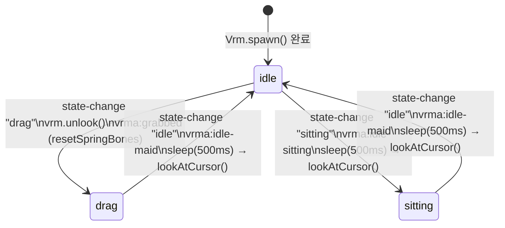
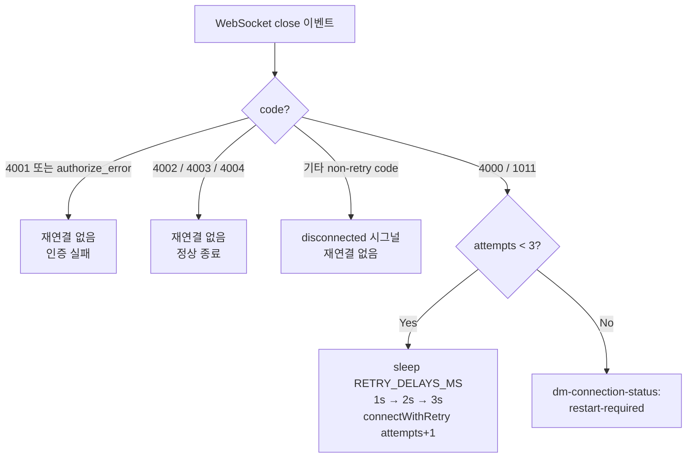
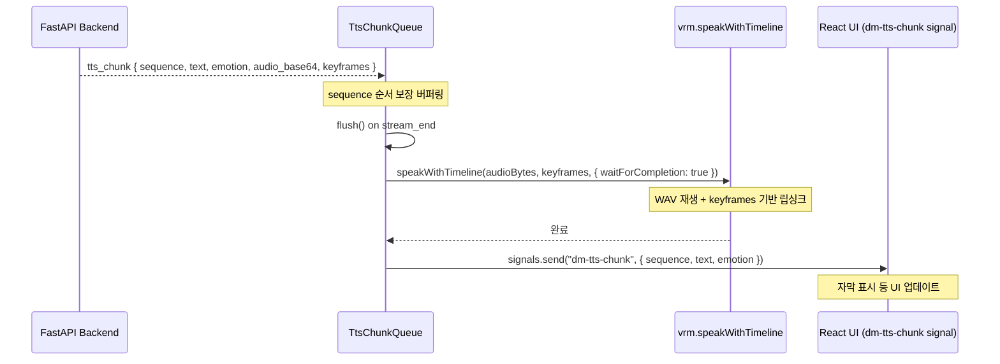

# desktopmate-bridge Startup Flow

Updated: 2026-04-05

## Overview

`service.ts`가 homunculus engine에 의해 실행될 때의 초기화 순서와 WebSocket 연결 흐름.
`tsx` 런타임으로 직접 실행 (빌드 스텝 없음).

---

## 시작 시퀀스

---

## VRM 상태 머신

VRM이 드래그/클릭 등 사용자 인터랙션에 따라 상태를 변경할 때 자동으로 애니메이션이 전환된다.

모든 애니메이션: `repeat.forever()`, `transitionSecs: 0.5`

---

## WebSocket 재연결 정책

| close code | 의미 | 재연결 |
|------------|------|--------|
| 4000 | Ping timeout | 최대 3회 |
| 1011 | Internal server error | 최대 3회 |
| 4001 | Auth failed | 없음 |
| 4002 | Concurrent turn | 없음 |
| 4003 | Stream interrupted | 없음 |
| 4004 | Turn not found | 없음 |

---

## TTS Chunk 처리 흐름

---

## Appendix

- 구현: `desktop-homunculus/mods/desktopmate-bridge/src/service.ts`
- VRM 에셋 ID: `desktopmate-bridge:elmer` (하드코딩, TODO: UI 설정 연동)
- config 경로: `mods/desktopmate-bridge/config.yaml`
- transform 저장: `preferences.db` key `"transform::desktopmate-bridge:elmer"`
